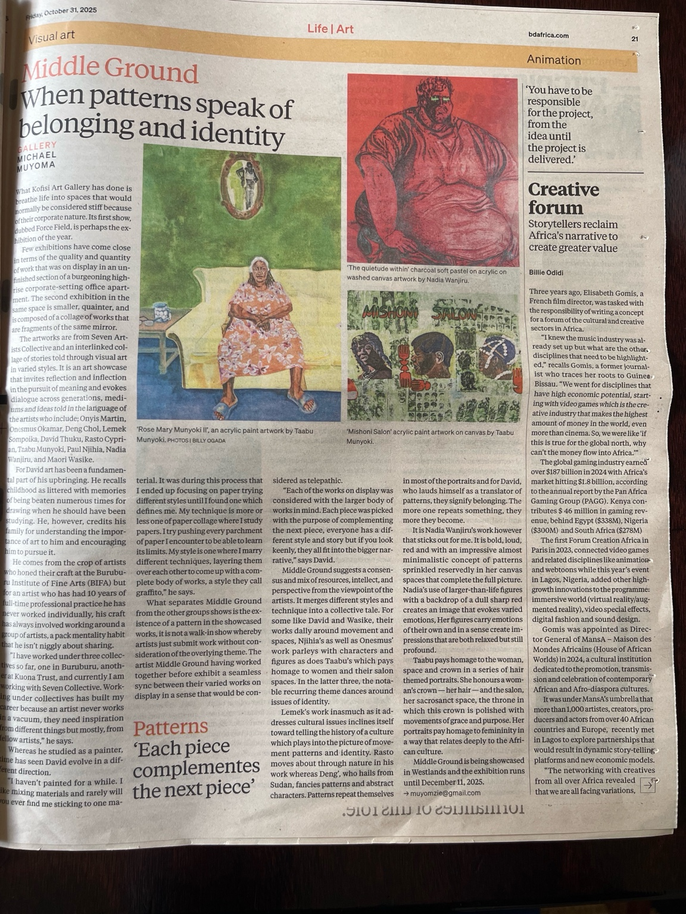

<div>
    
</div>

```py
# Clean and improve OCR output readability
clean_text = pytesseract.image_to_string(image, lang="eng", config="--psm 4")

# Save as a markdown file
md_path = "/mnt/data/Middle_Ground_Article.md"
with open(md_path, "w", encoding="utf-8") as f:
    f.write(clean_text)

md_path
```

# Middle Ground: When Patterns Speak of Belonging and Identity

**Visual Art | Life | Art**  
*By Rachel Muyoma*

What Kofisi Art Gallery has done is breathe life into spaces that would normally be considered stiff because of their corporate nature. Its first show, Robbed Force Field, is perhaps the exhibition of the year.

Few exhibitions have come close in terms of the quality and quantity of work that was on display in an underutilized section of a towering high-rise corporate-setting office apartment. The second exhibition in the same space is smaller, quainter, and is composed of a collage of works that are fragments of the same mirror.

The artworks are from Seven Artist Collective and from an interlinked collage of stories told through visual art in varied styles. It is an art showcase that invites reflection and inflection in the pursuit of meaning and evokes dialogue across generations, mediums and ideas told in the language of the artists who include: Onyis Martin, Oesmus Okamar, Deng Chol, Lemek Sengoika, David Thuku, Rasto Cyprian, Taabu Munyoki, Paul Njihia, Nadia Wanjiru, and Morir Waihe.

For David art has been a fundamental part of his upbringing. He recalls childhood as littered with memories of times better, painting techniques honed tracing when he should have been studying. He, however, credits his family for understanding the importance of art to him and encouraging him to pursue it.

In comes from the crop of artists who honed their craft at the Buruburu Institute of Fine Arts (BIFA) but later either who has had 10 years of working in this professional practice he has now worked individually, his craft has always involved working around a tangle of artists, a pack mentality habit that he isn't rigidly about shattering.

"I have worked under three collectives so far, one in Buruburu, another in Kuona Trust, and currently I am working with Seven Collective. Working under collectives has built my career because an artist never works in vacuum, they need inspiration from different things but mostly, from other artists," he says.

Whereas he studied as a painter, he has seen David evolve in a different direction.

"I haven't painted for a while. I am mixing materials and rarely will I ever find me sticking to one material. It was during this process that I ended up focusing on paper trying different style mediums that define me. My technique is more or less one of paper collage where I study papers. I try pushing every parchment of paper I encounter to be able to learn its limits. My style is one where I marry different techniques, layering them over each other to come up with a complete body of works, a style they call graffito," he says.

What separates Middle Ground from the other groups shows is the existence of a pattern in the showcased works. It is not a walk-in show whereby artists just strut with their artwork without considering everything theme. The artists Middle Ground have worked together before to exhibit a seamless sync between their varied works on display in a sense that would be considered as telepathic.

## Patterns: 'Each piece complements the next piece'

"Each of the works on display was considered with the larger body of works in mind. Each piece was picked with the purpose of complementing the next piece, everyone has a different style and story but if you look keenly, they all fit into the bigger narrative," says David.

Middle Ground suggests a consensual mix of resources, intellect, and perspective from the viewpoint of the artists. It merges different styles and technique into a collective tale. For some like David and Waihe, their works daily around movement and spaces, Njihia's as well as Onesmus' work parleys with characters and figures as does Taabu's which pays homage to women and their salon spaces. In the latter three, the notable recurring theme dances around issues of identity.

Lemek's work inasmuch as it addresses cultural issues inclines itself toward telling the history of a culture which plays into the picture of movement patterns and identity. Rasto moves about through nature in his work whereas Deng', who hails from Sudan, fancies patterns and abstract characters. Patterns repeat themselves in most of the portraits and for David, who lauds himself as a translator of patterns, they signify belonging. The more one repeats something, they move they become.

It is Nadia Wanjiru's work however that sticks out for me. It is bold, loud, red and with an impressive almost minimalistic concept of patterns sprinkled reservedly in her canvas spaces that complete the full picture. Nadia's use of larger-than-life figures with a backdrop of a dull sharp red creates an image that evokes varied emotions. Her figure resray emotions of their own and in a sense create impressions that are both relaxed but still profound.

Taabu pays homage to the woman, space and crown in a series of hair themed portraits. She honours a woman's crown — her hair — and the salon, her sacrosanct space, the throne in which this crown is polished with movements of grace and purpose. Her portraits pay homage to femininity in a way that relates deeply to the African culture.

Middle Ground is being showcased in Westlands and the exhibition runs until December 11, 2025.  
📧 rmuyoma2@gmail.com

---

## Animation

### Creative Forum
**Storytellers reclaim Afrikastartups to create greater value**

*By Billie Odidi*

Three years ago, Elizabeth Gomis, a French film director, was tasked with the responsibility of writing a concept for a forum of the cultural and creative sectors in Africa.

"I knew the music industry was already set up but what are the other, disciplines that need to be highlighted," recalls Gomis, a former journalist who took her roots to Guinea Bissau. "We wert for disciplines that have high economic potential, starting with video games which is the creative industry that makes the highest amount of money in the world, even more than cinema. So we were like 'if this is true for the global north, why can't it be money flow into Africa.'"

The African games market was valued over $187 billion in 2024 with Africa's market sitting $4.3 billion, according to the annual report by the Pan Africa Gaming Group (PAGG). Kenya contributed $ 46 million in gaming revenue. North and South Africa ($730M and South Africa ($378M).

The first Forum Creation Africa in Paris in 2023, connected video games and related disciplines like animation and webtoons while this year's event in Lagos, Nigeria, added other high-growth innovations to the programme: immersive world (virtual reality), augmented reality, video special effects, digital fashion and sound design.

Gomis was appointed as Director General of Mansa - Maison des Mondes Africains (House of African Worlds) in 2024, a cultural institution dedicated to the promotion, transmission and valorization of contemporary African and Afro-diaspora cultures.

It was under Mansa's umbrella that more than 1,000 artistes, creators, producers and across from over 40 African countries and Europe, recently met in Lagos to explore partnerships that would result in dynamic story-telling-platforms and new economic models.

"The networking with creatives from all over Africa revealed to me that we are all facing variations..."

---

**Image Captions:**
- "The quietude within" charcoal soft pastel on acrylic oil on washed canvas artworks by Nadia Wanjiru
- "Rose Mary Munyoki II", an acrylic paint artwork by Taabu Munyoki. PHOTOS | BILLY OGADA
- "Mishoni Satori" acrylic paint artwork on canvas by Taabu Munyoki

*"You have to be responsible for the project, from the idea until the project is delivered."*
